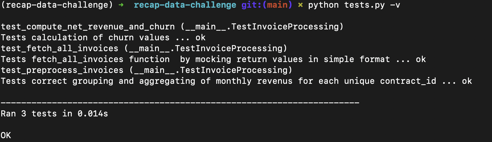

[](https://github.com/CMaxK/recap-data-challenge/actions/workflows/ci.yml)

# recap-data-challenge

## Goal
1. To find net monthly revenue per contract ID
2. To calculate the monthly churned amount per contract ID, per month

## Methodology
1. Fetch all invoices and save to file
2. EDA and Transformation to handle **net revenue** and **churned amount**. The heavy lifting is done in the helpers.py script. I first preporcess the invoices by aggregating monthly invoices for each unique contract ID. I then create a new column to calculate the previous months net_revenue and shift it to next month to allow for a direct comparison between the current month and previous month. If no previous month exists, the churn is equal to 0. I then drop the temporary column to make the table in line with what was shown in the instructions.
3. Refactor notebook code into .py scripts
4. Add tests + CI

## How to run code:
I like to use pyenv to set up a clean environment. To set up the same env simply:
1. Navigate to where the code should be stored
2. ```git clone https://github.com/CMaxK/recap-data-challenge.git```
3. ```pyenv virtualenv 3.10.6 recap-data-challenge```
4. ```pyenv activate recap-data-challenge```
5. ```pip install requirements.txt```

Once you have the code stored locally you can run the main script by navigating into the recap-data-challenge directory via:  
```cd recap-data-challenge```  
Followed by:  
```python main.py```  
If you see **Completed running of main.py** printed in the terminal, this means you have succesfully completed all necessary steps so far. If the script could not run, you will see other errors (detailed within comments of main.py script)

You will now have a copy of the cleaned final csv with net revenue and churn amounts in a data folder stored as [net_revenue_churn.csv](data/net_revenue_churn.csv). The original json object containing all invoices (Task 1) is also stored in the data folder as [invoices.json](data/invoices.json)

My initial Python code and some EDA on the final csv file is documented in the *notebooks/recap_data_challenge.ipynb* [notebook](notebooks/recap_data_challenge.ipynb). At the bottom I list the contract id's with the highest to lowest churn amounts. 

I included some unittests and incorporated these into a CI workflow. 
To run the tests simply run:
```python tests.py -v```
This returns a verbose overview of all tests using the unittest library. The passing tests should look like this:  


The CI workflow includes a linter and refactoring functionality. I currently bypass the linter but with more time I would fix linting issues.
